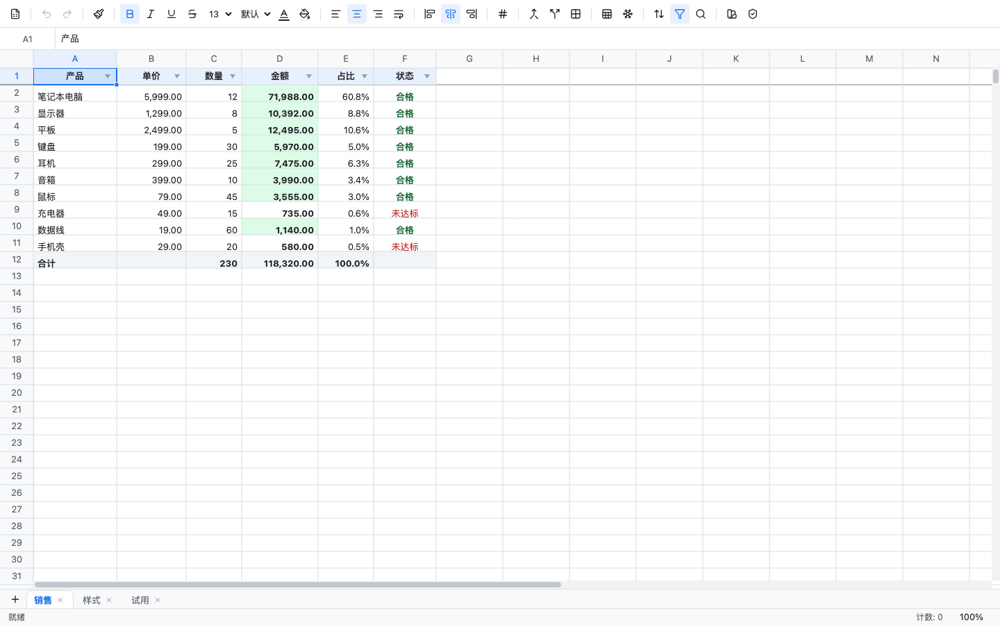

# xexcel

[](./LICENSE)
[](https://www.npmjs.com/package/@xexcel/react)
[](https://github.com/ximing/xexcel/actions/workflows/ci.yml)
[](https://ximing.github.io/xexcel/)

English | [简体中文](./README.zh-CN.md)

Embeddable Excel-style spreadsheet for the browser. Architecture follows ProseMirror: **everything is State + Transaction + Plugin**; the view is only a projection of state.

[Live demo](https://ximing.github.io/xexcel/) · [npm `@xexcel/react`](https://www.npmjs.com/package/@xexcel/react) · [Contributing](./CONTRIBUTING.md)



## Install

```bash
pnpm add @xexcel/react @xexcel/view @xexcel/core
# or: npm i @xexcel/react @xexcel/view @xexcel/core
```

```tsx
import { Workbook } from '@xexcel/core'
import { ExcelEditor, createStateFromWorkbook } from '@xexcel/react'
import '@xexcel/react/styles.css'

export function App() {
  const state = createStateFromWorkbook(
    Workbook.create({ rowCount: 1000, colCount: 26 }),
  )
  return <ExcelEditor state={state} locale="en" />
}
```

`@xexcel/core` is DOM-free and runs in Node (formulas, xlsx/CSV). `@xexcel/view` is the Konva canvas. `@xexcel/react` is the editor chrome.

## Features

- **Edit & formulas** — in-cell editing, lexer/parser/eval, cross-sheet refs, number formats
- **Style** — font / size / bold-italic / underline-strike / align / wrap / colors / borders (8 presets × 8 line styles) / format painter
- **Structure** — multiple sheets (add / rename / reorder) / insert-delete rows & cols / hide / row height & column width / merge / freeze
- **Data** — sort (quick + multi-key) / autofilter / find-replace / conditional formatting / data validation (number range / text length / list)
- **Interop** — CSV import-export / xlsx import-export via exceljs (values, formulas, styles, merges, freeze, filter, CF, validation) / autosave to `localStorage`
- **Interaction** — multi-range selection / drag-move / rich clipboard / fill handle / context menu / keyboard

## What this is not

xexcel is a **small, readable embeddable kernel**, not an office suite. Out of scope for 0.1:

- realtime collaboration
- charts, pivot tables, sparklines
- VBA / macros / array-dynamic formulas
- full Excel function library (common functions only: `SUM` `AVERAGE` `COUNT` `MIN` `MAX` `IF` `SUMIF` `COUNTIF` `AVERAGEIF` `ABS` `ROUND` and friends)
- print layout / page setup
- mobile-first touch editing

If you need collaboration, charts, and a full function library, look at [Univer](https://github.com/dream-num/univer). If you want a drop-in Excel look-alike that grew out of Luckysheet, look at [FortuneSheet](https://github.com/ruilisi/fortune-sheet). xexcel is for teams that want to **embed a spreadsheet they can actually read and change**.

## Packages

pnpm workspace. Dependencies flow one way: `react → view → core`.

| Package | Role |
|---|---|
| [`@xexcel/core`](./packages/excel-core) | Immutable model, steps, transactions, plugin framework, formula engine, xlsx/CSV. Zero DOM. |
| [`@xexcel/view`](./packages/excel-view) | Imperative Konva view + built-in interaction plugins |
| [`@xexcel/react`](./packages/excel-react) | `<ExcelEditor/>` + toolbar / formula bar / status bar + UI kit |
| `apps/demo` | Live demo (GitHub Pages source) |

Every document mutation goes through a Transaction/Step. Views, plugins, and React components never write the doc directly.

## Keyboard

`Mod` is ⌘ on macOS and Ctrl on Windows/Linux. Copy / cut / paste use the browser events (`Mod+C` / `Mod+X` / `Mod+V`); the fill handle is mouse-only.

| Keys | Action |
|---|---|
| Arrow | Move the active cell |
| Shift+Arrow | Extend the selection |
| Tab / Shift+Tab | Move right / left |
| Enter / Shift+Enter | Move down / up |
| Delete / Backspace | Clear the selection |
| F2 | Edit the active cell |
| Printable character | Start editing, replace contents |
| Mod+A | Select all |
| Mod+F | Find / replace |
| Mod+Z | Undo |
| Mod+Shift+Z or Ctrl+Y | Redo |
| Esc | Cancel format painter |

`<ExcelEditor locale="en" />` switches chrome (toolbar, file menu, context menu, status bar) to English. Default is `zh`.

## Develop

| Command | What it does |
|---|---|
| `pnpm dev` | Demo Vite server |
| `pnpm -r test` | Vitest unit tests |
| `pnpm -r typecheck` | `tsc --noEmit` |
| `pnpm -r build` | Typecheck + production build |
| `pnpm test:e2e` | Real-Chrome regression (38 scenarios) |

Tests: 536 unit tests across 72 files, plus 38 e2e scenarios.

See [CONTRIBUTING.md](./CONTRIBUTING.md) for setup and [docs/publishing.md](./docs/publishing.md) for npm releases.

## License

[MIT](./LICENSE)
